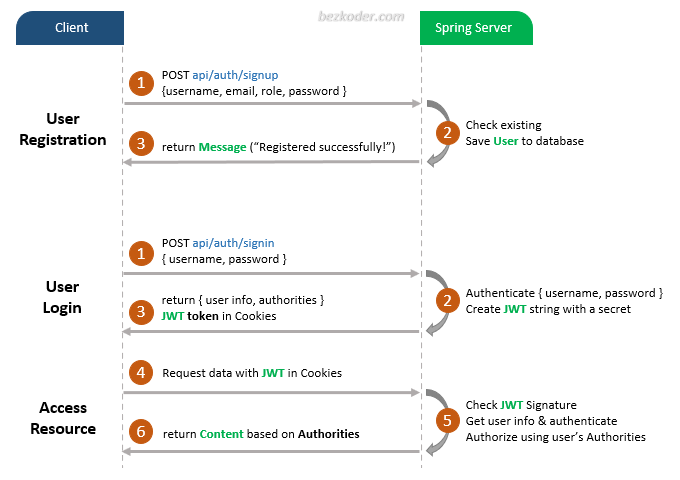

# Spring Boot Login example with Spring Security, MySQL and JWT

Built a Spring Boot Login and Registration example (Rest API) that supports JWT with HttpOnly Cookie.

- Spring Boot Rest Api Architecture with Spring Security
- How to configure Spring Security to work with JWT
- How to define Data Models and association for Authentication and Authorization
- Way to use Spring Data JPA to interact with MySQL Database

## User Registration, Login and Authorization process.



## Spring Boot Server Architecture with Spring Security


## Run Spring Boot application
```
mvn spring-boot:run
```

## Run following SQL insert statements
```
INSERT INTO roles(name) VALUES('ROLE_USER');
INSERT INTO roles(name) VALUES('ROLE_MODERATOR');
INSERT INTO roles(name) VALUES('ROLE_ADMIN');
```